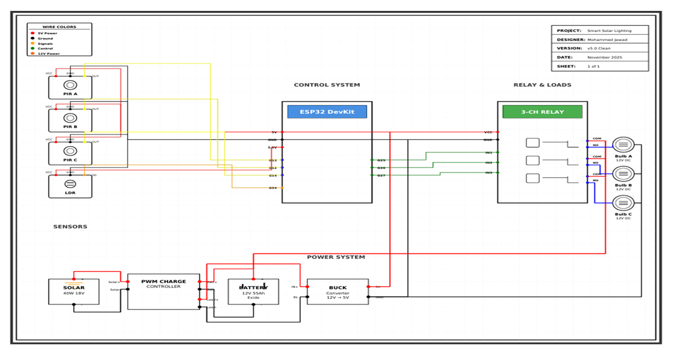

# Sustainable Corridor Lighting Solution Using Solar Panels

This project implements an automated corridor lighting system powered by solar energy. The system uses PIR motion sensors to detect human movement and automatically turn lights ON only when needed.

---

## Components Used

- ESP32 / Arduino
- PIR Motion Sensor
- Solar Panel
- Rechargeable Battery
- LED Lights

---

## Features

- Motion-based automatic lighting
- Energy-efficient system
- Solar powered lighting
- Battery backup for night operation

---

## Working Principle

The PIR sensor detects human motion in the corridor.  
When motion is detected, the ESP32 activates the LED lights automatically.

The solar panel charges the battery during the daytime and the stored energy powers the lighting system at night.

---

## System Diagram

---

## Applications

- Smart buildings
- College corridors
- Energy efficient campuses
